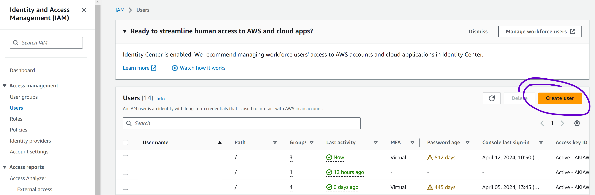

# React Monorepo Template

## Create user for deployment (AWS)

1. Go to IAM service
2. Click Users --> `Create User`

   

3. Fill the user name and click on `Next`
4. Click `Attach policies directly`, click on `AdministratorAccess` and click on `Next`
5. Click on `Create user`
6. View the created user.
7. Click on the tab `Security credentials` and click on `Create access key`
8. Click on the option `Command Line Interface (CLI)` and click on `Next`
9. Click on the button `Create access key`
10. Copy the keys `Access key` and `Secret access key`

## Configure serverless locally (OPTIONAL)

Execute the following command in your terminal:

```shell
npx serverless config credentials --provider aws --key <your aws access key> --secret <your aws secret access key>
```
